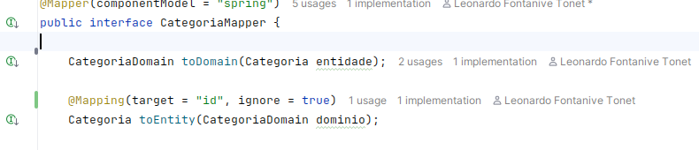

# Observações do projeto

### Plugin Maven Surefire [maven-surefire-plugin](https://maven.apache.org/surefire/maven-surefire-plugin/)

Plugin utilizado durante a fase de teste do software, informando os status dos teste na pasta */target/surefire-reports*. É importante para que os testes funcionem adequadamente.

### Uso do Mapper: *target* e *source*

Observei algo interessante quanto ao uso da função do *target* e *source* do Mapper.

Eu havia questionado do por que devo usar a notação no **toEntity()** e não no **toDomain()**. Isso havia me dado dor de cabeça porque o ID não era mapeado corretamente e criava um **CategoriaDomain** sem ID, gerando uma exceção.

Segundo o que percebi, utilizar a notação:
`
@Mapping(source = "id", ignore = true)
`
significa que não quero que o novo valor do ID seja mapeado para quando for mapear o novo objeto, no caso, o ID do objeto `CategoriaDomain` não seria lido e atribuído ao objeto **Categoria**, no conversor `toEntity()`. Entretanto, como quero copiar o ID do objeto `Categoria` para criar um domínio novo, preciso que o ID seja atribuído nele.

### JPA exige construtor sem argumentos
Uma exceção estranha que surgiu foi quando tentei criar uma entidade do tipo `Categoria`. Eu defini um construtor com entidade para que os parâmetros fossem injetados corretamente, seguindo o seguinte dilema: para que uma categoria exista, ela deve ter um nome. 

Pois bem, quando executei um caso de teste que faz uso do domínio, a seguinte exceção foi lançada: 

`
No default constructor for entity 'com.commerce.agile.entidade.Categoria'
        at org.hibernate.metamodel.internal.EntityInstantiatorPojoStandard.instantiate(EntityInstantiatorPojoStandard.java:93)
`

Pesquisei e descobri que isso é algo determinístico do JPA, que exige um construtor sem argumentos para funcionar corretamente. Mas, por quê? Segundo o que presquisei, JPA faz instanciação via reflexão, como que fazendo isto:

`Categoria categoria = Categoria.class.getDeclaredConstructor().newInstance();`, que exige construtor sem parâmetros. Além disso, ele cria entidade separadamente para depois injetar os parâmetros. Se JPA faz dessa forma, então teria que ter um construtor sem parâmetros para ele.

### Retorno de Entidade pelo Repository JPA

Estive adicionando um validador para verificar a existência de categorias já existente no sistema para evitar duplicatas. Criei o método `findCategoriaByNome()` que retorna um `Optinal<String>`, na crença de que cumpriria meu propósito. 

`if(categoriaRepository.findCategoriaByNome(requestCategoriaDTO.nome()).isPresent()){throw new DuplicidadeException("Não é permitido categorias duplicadas");
        }`

Entretanto, uma exceção fora lançada: 

`org.springframework.orm.jpa.JpaSystemException: Specified result type [java.lang.String] did not match Query selection type [com.commerce.agile.entidade.Categoria] - multiple selections: use Tuple or array`

Não estava compreendendo por que isso ocorreu. Não deveria o método do repositório encontrar a categoria por meio do nome que informei e retornar um *true*? Depois que pesquisar vi que não era bem assim. Quando se faz uma requisição para o repository ele envia uma Query SQL da seguinte maneira:

`SELECT categoria WHERE categoria.nome = ?`

Logo, entendi que ele na verdade está **retornando a entidade inteira que possua esse nome informado**, não um booleano. Para isso, precisarei criar o método `existsByNome(String nome)`, que vai, sim, retornar um booleano quando encontrar o nome correspondente - é o que quero que ocorra.

Depois desta correção tudo funcionou perfeitamente. Sem categorias duplicadas dessa vez.

